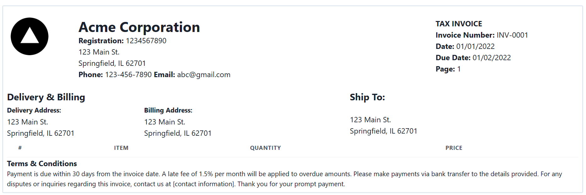

# Invoice Generator
An invoice generation software powered by Next.js with Chakra UI. This software aims to streamline workflow for company that trade goods such as wholesalers to speed up customers order process for delivery. 

It appears that most companies rely on manual process of invoice which is time-consuming, error-prone and ineffective and require extra labor force when facing increase orders. By collecting data from each order, an automatic process can be used to immediately produce invoice for delivery once order is being confirmed and processed. 



## Getting Started

First, run the development server:

```bash
npm run dev
# or
yarn dev
# or
pnpm dev
# or
bun dev
```

Open [http://localhost:3000](http://localhost:3000) with your browser to see the result.

You can start editing the page by modifying `app/page.tsx`. The page auto-updates as you edit the file.

This project uses [`next/font`](https://nextjs.org/docs/basic-features/font-optimization) to automatically optimize and load Inter, a custom Google Font

## 🛣️ Roadmap
- PDF generation feature
- Data input feature
- Live page preview feature
- Others
  
## 🐛 Bugs
- Template display inconsistent to display size